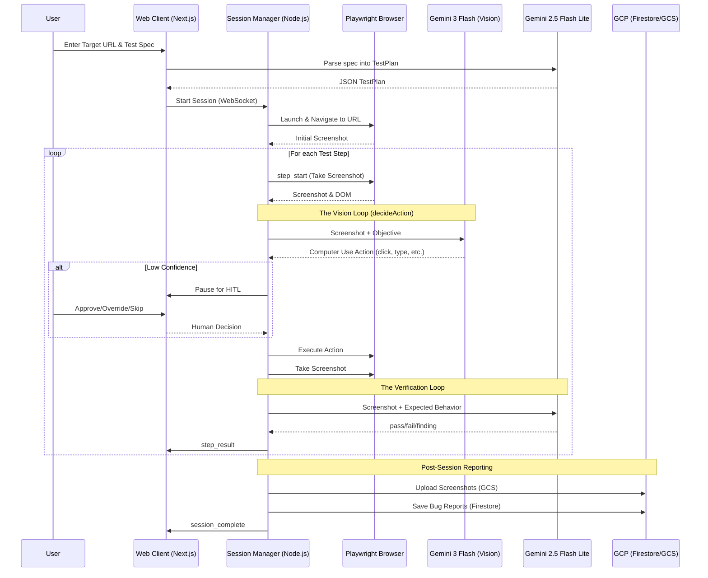
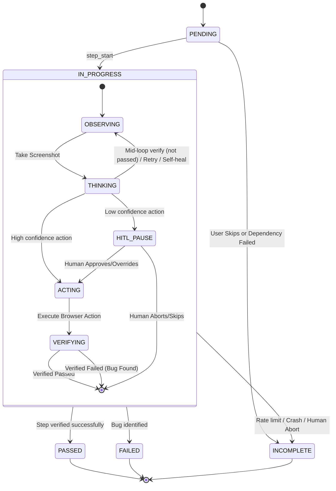
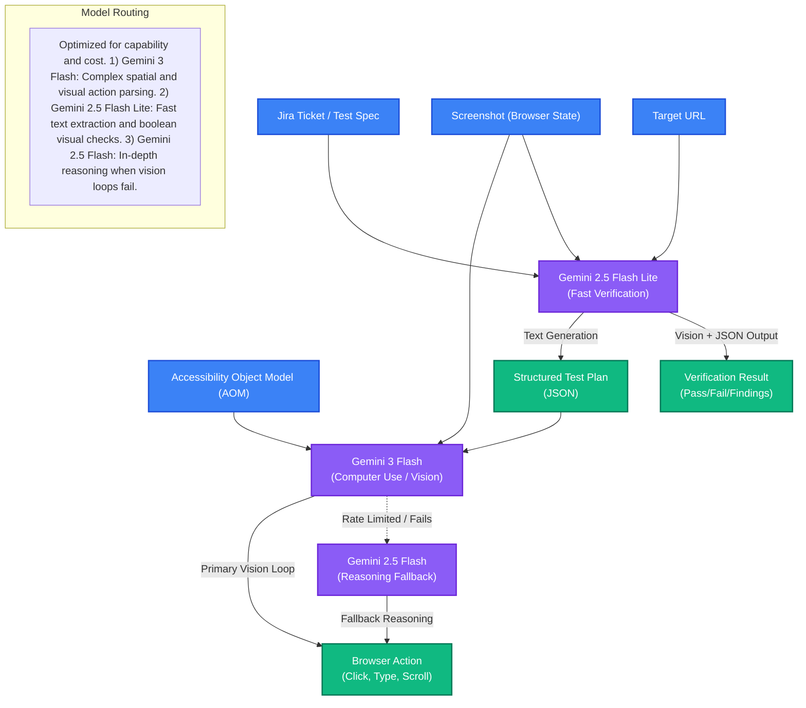

# Verifai Architecture

Verifai uses a modern, real-time architecture optimized for AI-driven browser automation and human-in-the-loop interventions.

## High-Level System Diagram

## Core Components

### 1. Web Client (Frontend)
Built with Next.js, Tailwind CSS, and shadcn/ui. 
- **Configure**: Collects Target URL and Test Spec (from user or Jira).
- **Execute**: A real-time WebSocket dashboard displaying the agent's browser view, a streaming execution transcript, and the live status of each test step.
- **HITL Overlay**: A pause modal that takes over the screen when the AI Agent needs human help.
- **Test History**: Fetches past execution results and aggregated statistics from Firestore.

### 2. Agent Server (Backend)
Built with Node.js and Socket.io.
- **Session Manager**: The core loop. Ingests the `TestPlan`, spins up a Playwright browser, navigates, takes screenshots, talks to Gemini, and iterates.
- **HITL Manager**: Calculates model confidence. If an action or verification falls below `HITL_ACTION_THRESHOLD` or `HITL_VERIFY_THRESHOLD`, it pauses the session, emits an event to the UI, and waits for a human decision to unblock it.
- **Demo Recording Manager**: Optionally serializes and records the entire DOM / AI interaction stream for latency-free replay during live presentations.

### 3. Google Gemini (AI Layer)
Implements a multi-model architecture routing tasks to the optimal model based on capability and cost:
- **Gemini 3 Flash**: Handles all granular Computer Use interaction (click, type, scroll) driven by vision.
- **Gemini 2.5 Flash Lite**: Fast model optimized for text and layout comprehension. Used for generating test plans from initial specs and verifying step success.
- **Gemini 2.5 Flash**: Standby model for fallback reasoning if the primary action model loops or gets stuck.

### 4. GCP & External Integrations
- **Cloud Storage**: Hosts images from the automation timeline to ensure reports have permanent, public links to bug screenshots.
- **Firestore**: NoSQL cloud database persisting all structured `BugReport` and tracking analytics.
- **Jira Cloud**: Receives API calls to auto-create bug tickets complete with replication steps and visual proof from Cloud Storage.

## Execution Flows

### The Core Vision Loop Details

The heart of the application is the `executeStepWithVisionLoop` function in `routes/session.ts`. It follows a specific self-healing and escalation pattern:

1. **Observe**: Take a screenshot and grab the Accessibility Object Model (AOM) from Playwright.
2. **Think**: Send the screenshot to Gemini 3 Flash to decide the next action (`click`, `type`, `scroll`, etc.).
   - *Fallback Mechanism*: If the vision model errors (e.g., rate limits), it falls back to Gemini 2.5 Flash for reasoning.
   - *Escalation Mechanism*: If the vision model claims the step is complete but the verification model disagrees, it escalates to a slower, higher-capability "Pro" model.
3. **Log/HITL**:
   - Calculate confidence based on the action. If confidence is below `HITL_ACTION_THRESHOLD`, pause the session and wait for a user to decide (Proceed, Skip, Retry, Abort, Override).
   - Emit live narration and Text-to-Speech (TTS) updates to the UI via WebSocket.
4. **Act**: Execute the Playwright native action.
   - *Self-Healing*: If an action fails (e.g., bad coordinates or element not found), the agent automatically takes a new screenshot and retries with a self-correcting prompt.
5. **Mid-Loop Verification**: Take a screenshot after the action and verify it with Gemini 2.5 Flash Lite. If it passes, break the loop early; otherwise, continue trying up to 5 actions per step.

### Test Step State Transition Diagram

Every step in a Verifai `TestPlan` goes through a strict state machine. Steps can pass, fail with bugs, be skipped by the user, or drop out due to infrastructure errors.

### Multi-Model Architecture Routing

Verifai utilizes different Gemini models based on the specific capability required for the task, optimizing for both performance and cost.

